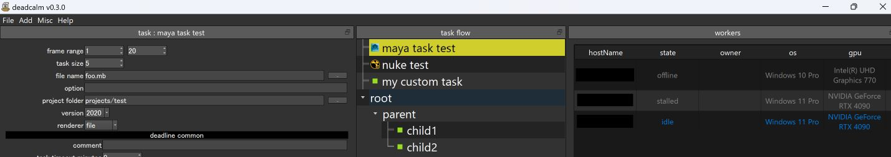

# DeadCalm

DeadCalm is a lightweight Python wrapper script for submitting jobs to AWS Thinkbox Deadline.



## Features

- Submit jobs with simple scripting.
- Create custom task chains by linking your own tasks, with support for sequential or parallel execution.
- Operate through a user-friendly GUI.

## Prerequisites

- Deadline version 10.3 or later.
- Ensure that the Deadline web service is running and accessible from the host submitting jobs.

## Environment Setup

Using Anaconda is recommended for setting up the environment.

```bash
conda create -n deadcalm
```

To Install the Deadline standalone Python API, Just copy the Deadline folder from <your_repository>/api/python/Deadline to the site-packages folder you just created.

Clone the source code and install dependencies:

```bash
git clone https://github.com/tsym1101/deadcalm
cd deadcalm
conda activate deadcalm
pip install -r requirements.txt
```

Set up PySide2 resources:

```bash
python gen_ui.py
pyside2-rcc gui_resources.qrc -o gui_resources_rc.py
```

## Configuration

Copy the default configuration file and edit it:

```bash
cp config.default.json config.json
```

Update `config.json` with the parameters you want to override from `config.default.json`. At a minimum, you need to specify the hostname or IP of the Deadline web service:

```json
{
  "deadline_webservice": ["localhost", "8081"]
}
```

## Starting the Main Window

```bash
python main.py
```

## GUI Operations

1. Create a task from the menu bar.
2. Set task parameters in the Task Panel.
3. Select workers to submit from the Worker Panel. Multiple selections are supported.
4. In the Job Panel, input a job title and project name, then click the **Submit** button to submit the job.

## Documentation
- [How to Use TaskChainSample.py](samples/HowToChainTasks.md)


## Notice

- This script includes legacy components.
- Experimental scripts for integration with AWS Cloud are included. These require significant infrastructure setup and are not functional as standalone components.

---

## License
This project is licensed under the MIT License.  
See the [LICENSE](./LICENSE) file for details.
